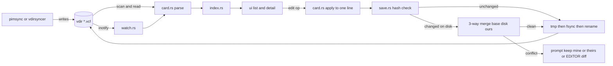

# Building a lossless vCard TUI over a vdir

2026-09-25. Follow-up to [contacts-tui.md](./contacts-tui.md) (no maintained contacts TUI exists; sync with vdirsyncer or pimsync into a vdir; khard rewrites `BDAY`). This file covers what to build, which crates to use, and whether lossless round-trip is achievable in Rust today. The experiment harness is in the session scratchpad (`vcard-roundtrip/`). It is throwaway and not committed.

## TL;DR

**Build it, in its own repo, in Rust + ratatui, over the vdir. Sync stays out of scope.** The agreed direction holds up against the evidence.

- **Parser: `vcard-rs` 0.4.0 (pimalaya), pinned and wrapped in one module.** It is the only crate that passed every test: 5/5 fixtures round-tripped byte-identical, including one that is not valid UTF-8. With the line-level API it passed 10/10 edits that touched only the target property. Its typed lens API missed a grouped `item2.TEL`, so it scored 9/10 there.
- **Its health is the risk.** First release 2026-07-16, 1★, 287 downloads, 76 commits in 12 months, all from one author, AI-assisted by stated policy.
- **The fallback is cheap and proven.** `vparser` 1.2.1 (the tokenizer pimsync's `vstorage` uses), plus a 44-line splice, passed 8/8 UTF-8 edits. A full home-grown layer is about 800 LOC plus tests.
- **Every other crate rewrites untouched lines.** That covers calcard, vcard4, vobject, ical, caldata, ical_vcard and vcard_parser. Some of those rewrites change data: vobject drops repeated `TYPE` values, and calcard escapes the comma in a `data:` URI.
- **MVP:** fuzzy list, detail pane, field edit, create, delete, atomic write, a file watch that reloads, a conflict check on save, a raw `$EDITOR` fallback, and a `query` subcommand for aerc/mutt completion.
- **Top risks:**
  - The syncer writes a file while you are editing it. Fix: hash-compare before rename, then a three-way merge (`vcard-rs` has one).
  - Baïkal hands 4.0 cards back as sabre-converted 3.0, with Apple quirks (`X-APPLE-OMIT-YEAR=1604`, `itemN.` groups) even if no Apple device ever wrote them.
  - `vcard-rs` could be abandoned.

## Why a new tool is justified

- Prior research found 0 maintained vCard TUIs. khard is the best client, but every edit deletes and re-adds `BDAY` ([contacts.py L1252-L1254](https://github.com/lucc/khard/blob/main/khard/contacts.py#L1252-L1254)).
- **Nobody offers lossless editing.** khard re-serializes through vobject. rldx re-serializes through vcard4, which this experiment shows produces a 23-line diff on a 20-line Apple card (reordering plus rewrites). cardamum edits raw text in `$EDITOR`: lossless, but with no structure.
- The `toml_edit` model maps cleanly onto vCard. Content lines are independent (RFC 6350 §3.3 `contentline = [group "."] name *(";" param) ":" value CRLF`, [rfc6350](https://www.rfc-editor.org/rfc/rfc6350#section-3.3)). Keep the raw lines and re-emit only the ones you touch.

## Standards constraints that shape the design

- **Folding:** a logical line SHOULD be folded to 75 octets. Unfolding removes CRLF + one space or tab ([RFC 6350 §3.2](https://www.rfc-editor.org/rfc/rfc6350#section-3.2)). Writers can split a UTF-8 sequence; readers SHOULD restore it. So you need a byte-level parser, not a `&str` one.
- **Escaping:** `,` MUST be escaped in values, `;` only in compound fields (N, ADR, ORG), and `\` always ([RFC 6350 §3.4](https://www.rfc-editor.org/rfc/rfc6350#section-3.4)). Writers differ on `\;` in NOTE, so re-escaping an untouched NOTE creates a diff.
- **BDAY:** 4.0 allows `--0415` (reduced accuracy, [§6.2.5](https://www.rfc-editor.org/rfc/rfc6350#section-6.2.5)). 3.0 defines only date or date-time ([RFC 2426 §3.1.5](https://www.rfc-editor.org/rfc/rfc2426#section-3.1.5)), which is why Apple and sabre invented `X-APPLE-OMIT-YEAR`.
- **CardDAV:** one vCard per resource. UID MUST be present and unique per collection ([RFC 6352 §5.1](https://www.rfc-editor.org/rfc/rfc6352#section-5.1)). A PUT MUST NOT change an existing resource's UID (`no-uid-conflict`, [§6.3.2.1](https://www.rfc-editor.org/rfc/rfc6352#section-6.3.2.1)). Servers MUST keep `X-` properties ([§6.3.2.2](https://www.rfc-editor.org/rfc/rfc6352#section-6.3.2.2)).
- **vdir:** `.vcf` files, one contact per file, a UID SHOULD be present, and the filename is opaque ([vdir.rst](https://github.com/pimutils/vdirsyncer/blob/main/docs/vdir.rst)). Writes SHOULD be atomic via a `.tmp` file in the same collection, and an edit MUST keep the original filename. Readers MUST ignore `*.tmp` files and files with no extension.

## Writer quirks the TUI will see

| Source | Quirk | Evidence |
|---|---|---|
| **Baïkal (sabre/vobject 4.x)** | Serves 4.0 cards as 3.0 by default. On conversion, a year-less BDAY becomes `1604-MM-DD;X-APPLE-OMIT-YEAR=1604`. | [VCardConverter.php L107](https://github.com/sabre-io/vobject/blob/4.6.1/lib/VCardConverter.php#L107); Baïkal pins `sabre/dav ~4.7.1`, which requires `sabre/vobject ^4.2.1` ([composer.json](https://github.com/sabre-io/dav/blob/4.7.1/composer.json)) |
| Baïkal (sabre) | 4.0 `ANNIVERSARY` becomes `X-ANNIVERSARY`, plus an added `ITEMn.X-ABDATE` and `ITEMn.X-ABLABEL:_$!<Anniversary>!$_` | [L122](https://github.com/sabre-io/vobject/blob/4.6.1/lib/VCardConverter.php#L122) |
| Baïkal (sabre) | A `data:` URI PHOTO becomes `ENCODING=b` inline binary | [L290-L331](https://github.com/sabre-io/vobject/blob/4.6.1/lib/VCardConverter.php#L290-L331) |
| Thunderbird | Writes vCard 4.0 by default (`propertyMapToVCard(abProps, version = "4.0")`) | [VCardUtils.sys.mjs L189](https://hg.mozilla.org/comm-central/file/tip/mailnews/addrbook/modules/VCardUtils.sys.mjs) |
| Apple | `itemN.` groups tie a value to its `X-ABLabel` label. `X-ABUID`, `X-ABADR`, `PHOTO;ENCODING=b;TYPE=JPEG`, repeated `type=` params. | Only through sabre's converter and khard's handling ([contacts.py L162-L180](https://github.com/lucc/khard/blob/main/khard/contacts.py#L162-L180)); no Apple spec found |
| Google | Not verified: no primary spec found. Treat it as "arbitrary 3.0". | - |
| vdirsyncer | Writes files with LF, not CRLF ([#1128](https://github.com/pimutils/vdirsyncer/issues/1128)). pimsync normalises to CRLF. | prior research |

- **Consequence:** even with zero Apple devices, a Thunderbird-written 4.0 card with a year-less birthday comes back from Baïkal as an Apple-style 3.0 card. The TUI MUST show `X-APPLE-OMIT-YEAR` dates as year-less and MUST treat `itemN.X-ABLabel` as the label of the grouped field.
- **Consequence:** the vdir can hold both LF and CRLF files. Keep the EOL per file; never normalise it.

## Parser experiment

Setup: a throwaway cargo project with 9 crates at their latest crates.io versions (2026-09-25). There are 5 synthetic fixtures with no real data:

- `v3-apple-crlf`: CRLF, `item1-3.` groups with `X-ABLabel`, `BDAY;X-APPLE-OMIT-YEAR=1604:1604-04-15`, repeated `type=` params, a folded base64 `PHOTO;ENCODING=b`, `\,` and `\;` escapes, `X-SOCIALPROFILE` with an X-param.
- `v3-google-lf`: LF, `BDAY:--0415`, non-ASCII (äöü, 日本語) folded across 3 lines, a quoted param value containing `:` and `,`.
- `v3-split-utf8`: CRLF, and a fold that splits a 2-byte `é`, so the file is not valid UTF-8 (RFC 6350 §3.2 note).
- `v4-thunderbird-crlf`: CRLF, `BDAY;VALUE=DATE:--0415`, a `data:` URI PHOTO, `TYPE="voice,home"`, `PREF=1`, a NOTE with every escape.
- `v4-lf-tabfold`: LF, lowercase property names, the `home-1.` group, a TAB-folded NOTE, `IMPP`, `RELATED`.

Tests:

- **rt:** parse, then serialize. The output must be byte-identical to the input.
- **edit:** parse, set the first `TEL`, then the first `NOTE` (a long non-ASCII value), then serialize. Pass (`ONLY-TARGET`) means every other logical line is byte-identical, the line count is unchanged, and the target decodes to the new value. Total: 5 fixtures × 2 = 10 edits.

### Results

| Crate | Version | rt byte-identical | edit ONLY-TARGET | Lines rewritten on Apple card (of 20 logical) | Notes |
|---|---|---|---|---|---|
| **vcard-rs** (line API) | 0.4.0 | **5/5** | **10/10** | 0 | Only crate that reads non-UTF-8 input |
| vcard-rs (lens API `prop_mut::<TEL>()`) | 0.4.0 | 5/5 | 9/10 | 0 | Missed `item2.TEL`: see bug below |
| **vparser** + 44-line splice | 1.2.1 | 4/5 | 8/10 | 0 | The 2 failures are the non-UTF-8 fixture (input is `&str`) |
| caldata | 0.17.3 | 1/5 | 3/10 | 7 | Uppercases names, params and groups (`ITEM1.X-ABLABEL`); forces CRLF; refolds |
| ical_vcard | 0.5.0 | 0/5 | 1/10 | 7 | Uppercases names, params and groups; forces CRLF; refolds |
| ical | 0.11.0 | 0/5 | 0/10 | 4 | Uppercases params; forces CRLF; cannot read the non-UTF-8 fixture. **Repo archived.** |
| calcard | 0.3.14 | 0/5 | 0/10 | 5 | See data changes below |
| vcard4 | 0.7.3 | 0/5 | n/a | 23-line diff (reorders) | Converts 3.0 to `VERSION:4.0` |
| vobject | 0.9.0 | 0/5 | 0/10 | 26-line diff (reorders all) | `props: BTreeMap`, so output is alphabetical ([component.rs](https://docs.rs/crate/vobject/0.9.0/source/src/component.rs)) |
| vcard_parser | 0.2.3 | 0/5 (4 parse errors) | n/a | error | Rejects 3.0 and `N` with 6 components |

**Changes that alter data (not just cosmetic):**

- **vobject:** `type=INTERNET;type=pref` becomes `type=pref`. The params map is `BTreeMap<String, String>`, so a repeated param keeps only its last value. Apple's `CELL`/`VOICE`/`HOME` are lost ([property.rs](https://docs.rs/crate/vobject/0.9.0/source/src/property.rs)).
- **calcard:**
  - `PHOTO:data:image/png;base64,…` is written back as `base64\,…`, which corrupts the URI.
  - Adds `CHARSET=UTF-8` to 3.0 non-ASCII lines.
  - Rewrites `--0415` as `--04-15`.
  - Uppercases `KIND:individual` to `INDIVIDUAL`.
- **vcard4:**
  - Rewrites `VERSION:3.0` as `4.0`.
  - Rewrites `TYPE=HOME,pref` as `TYPE=X-HOME,X-pref`.
  - Rewrites BDAY as `16040415` and quotes the `X-APPLE-OMIT-YEAR` param.
  - Drops the `\;` escape (legal per §3.4, but a diff).

**vcard-rs findings:**

- **Lens API bug:** `VcardCst::prop`/`prop_mut` compare `line.name` to the property kind. `name` is documented as "the property name leaf, with any group prefix", so any grouped property is invisible to the typed lenses ([cst.rs](https://docs.rs/crate/vcard-rs/0.4.0/source/src/tree/cst.rs), [line.rs](https://docs.rs/crate/vcard-rs/0.4.0/source/src/tree/line.rs)). **Workaround:** iterate `cst.props`, match the name after the last `.`, then edit through `VcardValueCursor { line }`. That passed 10/10. Worth reporting upstream.
- An edited line loses its fold: the wire shape is dropped once the length changes (crate docs). The NOTE edit produced a single 104-octet line. That is legal (SHOULD, §3.2), but you need your own refold on write if you want 75-octet lines.
- Byte-faithful by design: a CST (`VcardCst { begin, props, end, trailing }`), values kept as raw bytes, and per-line `eol` and `wire`. It also has a three-way `VcardMerge { base, left, right }`: "the left side supplies the baseline, so its folding, its parameter casing and its property order come out untouched" ([merge.rs](https://docs.rs/crate/vcard-rs/0.4.0/source/src/tree/merge.rs)). The merge is not tested here.
- Test surface: 207 `#[test]`s in `src/`, a proptest merge suite, and a corpus drawn from 9 sources (sabre, calcard, ez-vcard, emersion, rfc…) under `tests/corpus/`.

**Parse speed** (release build, 10,000 parses of the 5 fixtures): vparser 4.8 ms, vcard-rs 18.5 ms (about 1.8 µs per card), calcard 56 ms. Indexing 1,000 contacts in memory is bound by file I/O. **No SQLite index needed** (rldx uses SQLCipher).

### Crate health (crates.io API and `gh api`, 2026-09-25)

| Crate | License | Latest | First release | Downloads (90d) | Commits in 12 mo | Top author | 3.0 / 4.0 | Keeps unknown props / params / groups | Keeps order and format |
|---|---|---|---|---|---|---|---|---|---|
| [vcard-rs](https://github.com/pimalaya/vcard) | MIT OR Apache-2.0 | 0.4.0 (2026-08-31) | 2026-07-16 | 287 (287) | 76 | soywod 76/76, 1★ | 2.1, 3.0, 4.0 | yes / yes / yes | **yes, byte-faithful** |
| [vparser](https://crates.io/crates/vparser) | ISC | 1.2.1 (2026-04-10) | 2023-11-27 | 12,082 (617) | not checked (sr.ht) | Hugo Barrera | version-agnostic tokenizer | yes (raw lines) | yes (raw slices) |
| [calcard](https://github.com/stalwartlabs/calcard) | Apache-2.0 OR MIT | 0.3.14 (2026-09-15) | 2025-05-10 | 55,903 (19,853) | 37 | mdecimus, 75★ | 2.1–4.0 | yes / yes / yes | no |
| [caldata](https://github.com/lennart-k/caldata-rs) | Apache-2.0 | 0.17.3 (2026-09-20) | 2026-01-22 | 2,289 (1,083) | 189 | Lennart K (fork of ical-rs) | agnostic | yes / yes / name-prefixed | no |
| [ical_vcard](https://codeberg.org/darkfire/ical_vcard) | MIT OR Apache-2.0 | 0.5.0 (2026-08-14) | 2023-03-28 | 20,670 (296) | 50 | darkfireZZ 40 | content lines only | yes / yes / yes | no |
| [ical](https://github.com/Peltoche/ical-rs) | Apache-2.0 | 0.11.0 (2024-03-13) | 2016 | 1.55 M (277 k) | 0, **archived** | - | agnostic | yes / yes / name-prefixed | no |
| [vcard4](https://github.com/tmpfs/vcard4) | MIT OR Apache-2.0 | 0.7.3 (2026-02-07) | 2022-11-09 | 51,318 (7,865) | 2 | muji, 4★ | 4.0 only | partial | no |
| [vobject](https://github.com/untitaker/rust-vobject) | MIT | 0.9.0 (2026-04-01) | 2015 | 42,840 (951) | 3 | Ben Boeckel | agnostic | props yes, repeated params **no** | no |
| [vcard_parser](https://github.com/kenianbei/vcard_parser) | MIT | 0.2.3 (2026-05-30) | 2022-10-13 | 27,167 (11,333) | 3 | kenianbei | 4.0 only | - | no |
| [vcard](https://github.com/magiclen/vcard) (magiclen) | MIT | 0.5.0 (2026-07-11) | 2018 | 53,993 | 5 | Magic Len | 4.0 generator | - | not tested (builder/generator) |

- vcard-rs's AI disclosure: "Pimalaya projects are developed with AI assistance … Claude Code … Not used for: Engineering, critical code" ([AI_POLICY.md](https://github.com/pimalaya/.github/blob/master/AI_POLICY.md)). There were 4 minor releases (0.1 to 0.4) in 6 weeks, with a `**BREAKING**` entry in 0.4.0 and 0.3.1 ([CHANGELOG](https://docs.rs/crate/vcard-rs/0.4.0/source/CHANGELOG.md)).
- `vparser` is the tokenizer under `vstorage` 0.11, which pimsync 0.6 uses (pimsync `Cargo.lock` pins `vparser 1.1.0`). It has been 1.x since 2023-12-21.

### Parser verdict

- **Use `vcard-rs =0.4.0` behind a `card` module.** Expose your own `Card` type. Never leak `VcardCst` to UI code. Use the line API, not the lenses, until the group bug is fixed.
- **Differential test:** run every fixture and corpus card through both `vcard-rs` and the `vparser` splice, and assert the outputs are identical.
- **If `vcard-rs` stalls or regresses,** swap the module to the own layer below. Only the `card` module changes.

### Fallback: own line-preserving layer (sketch)

- Store `bytes: Vec<u8>` plus a `Vec<Line { span: Range<usize>, group, name, params: Vec<(name, Vec<value>)>, value_span, eol }>`.
- Tokenize with `vparser` (UTF-8 only), or with your own byte scanner if non-UTF-8 files matter (about 150 LOC).
- Edit: splice `bytes[line.span]` with `name;params:` + `escape(value)`, refolded at 75 octets with the file's own EOL. Copy every other byte as-is. The experiment's version is 44 lines.
- Typed views: FN, N, NICKNAME, ORG, TITLE, EMAIL, TEL, ADR, BDAY/ANNIVERSARY (with `X-APPLE-OMIT-YEAR` and `--MMDD`), NOTE, CATEGORIES, URL, UID, `itemN.X-ABLabel`. That is about 12 properties × 20 LOC.
- **Estimate: ~800 LOC plus ~400 LOC of tests**, and 1 dependency (`vparser`, ISC, 1,535 LOC, `no_std`).

## Prior art: what to steal, what to avoid

| Tool | Steal | Avoid |
|---|---|---|
| abook 0.6.2 ([help.h](https://git.code.sf.net/p/abook/git)) | `j/k`, `/` search, `\` next match, `Enter` view, `a` add, `r`/`Del` remove, `space` select, `M` merge selected, `U` remove duplicates, `m` mail, `v` open URL; field hotkeys `1-5`/`A-Z` in the detail view; `u` undo | Its own flat-file format; vCard only via `--convert` (lossy) |
| khard 0.21.0 | Field-scoped queries (`email:`, `name:`, `uid:`); `birthdays`; `--parsable` output; YAML-in-`$EDITOR` editing | Delete-and-re-add of every modelled field; 1900 placeholder year |
| aerc 0.22.0 | Contract: `address-book-cmd`, `%s` = text after the last comma, run via `sh -c`, tab-separated, email first, name second, extra fields ignored ([aerc-config(5)](https://git.sr.ht/~rjarry/aerc/tree/master/item/doc/aerc-config.5.scd)) | - |
| mutt | Contract: `query_command`. The first line is a message and is skipped; then `address\tname\tother`; exit non-zero on no match ([manual §4.8](http://www.mutt.org/doc/manual/#query)) | - |
| rldx (source read at `d1365f6`, 2026-01-11, 15,697 LOC) | Keymap (`/`, `h/l` panes, `e` edit field, `y` yank); abook-compatible `query`; atomic write via tmp + `sync_all` + rename + dir fsync ([vdir.rs L276-L337](https://github.com/verdigris12/rldx/blob/d1365f6/src/vdir.rs#L276-L337)) | See below |
| cardamum 0.2.0 | Raw `.vcf` in `$EDITOR` with validate-on-save | Talks CardDAV directly, basic auth only |

**What rldx gets wrong:**

- **First-run "normalize" rewrites the whole vdir.** For every 4.0 card it:
  - replaces any non-UUID UID with a fresh v4 UUID (`ensure_uuid_uid`), breaking RFC 6352 `no-uid-conflict` for existing resources;
  - bumps `REV`;
  - adds transliterated `FN`/`N`/`ORG` alternates with `ALTID`;
  - normalises phone numbers;
  - renames files to UUID prefixes and deletes the originals ([vdir.rs L104-L158](https://github.com/verdigris12/rldx/blob/d1365f6/src/vdir.rs#L104-L158), [vcard_io.rs L288-L301](https://github.com/verdigris12/rldx/blob/d1365f6/src/vcard_io.rs#L288-L301)).
- The syncer sees every rename as a delete plus a create, and the vdir spec says an edit MUST keep the original filename.
- It skips 3.0 cards (`needs_upgrade`), which are the default format coming out of Baïkal.
- It serializes through `vcard4`, which produced a 23-line diff on the 20-line Apple fixture.
- Scope creep: SQLCipher, age encryption, Google CSV import, maildir harvesting, simhash dedup, and its own CardDAV sync all sit in one binary with 43 dependencies. README: "vibe coded … not even in alpha".
- No file watcher (`grep notify` finds nothing). A change from the syncer shows up only on the next reindex.

## Features

### MVP

| Feature | Why |
|---|---|
| Fuzzy list (FN, NICKNAME, ORG, EMAIL, TEL in the haystack) | Main use: find a contact in under 1 s. `nucleo-matcher` scores 1,000 items in well under one frame. |
| Detail pane | Read without editing. Show labels from `itemN.X-ABLabel`, year-less BDAY from `X-APPLE-OMIT-YEAR`/`--MMDD`, and a list of unknown properties so nothing is hidden. |
| Edit one field inline (`e`) | This is the differentiator. It touches exactly one line; everything else stays byte-identical. |
| Raw `$EDITOR` fallback (`E`) | Covers every property the forms don't model. Validate by re-parsing before the atomic write. Fallback order: `$VISUAL`, `$EDITOR`, `vi`, the same as aerc ([aerc-config(5)](https://git.sr.ht/~rjarry/aerc/tree/master/item/doc/aerc-config.5.scd)). |
| Create (`a`) | Writes a new UUID `UID`, `FN`, `N`, `VERSION:3.0`, CRLF. The filename is `<UID>.vcf` when the UID is `[A-Za-z0-9_+-]`, matching vstorage's `SAFE_FILENAME_CHARS`. |
| Delete (`d`, with confirm) | Unlink only; the syncer propagates it. vdirsyncer's `StorageEmpty` and pimsync's `on_empty skip` guard against mass deletes. |
| Atomic write | Required by the vdir spec. Also needed for change detection: vstorage's etag is `"{mtime_secs};{ino}"`, so an in-place write within the same second would be missed ([vdir.rs](https://docs.rs/crate/vstorage/0.11.0/source/src/vdir.rs)). A rename gives a new inode. |
| File watch and reload | The syncer (a `pimsync daemon` or a timer) rewrites files while the TUI is open. `notify-debouncer-full` coalesces tmp + rename bursts. |
| Conflict check on save | See the architecture section. Without it, a save clobbers a server-side change. |
| `query <text>` subcommand | For aerc/mutt completion. `--mutt` prints the header line and exits 1 on no match. The default (aerc) prints no header. One line per EMAIL: `email\tFN`. |

### Later

- Multi-value editing (add or remove an EMAIL/TEL), a label picker for Apple groups, `CATEGORIES` filter/tags.
- `birthdays` view (upcoming, year-less aware); `y` to yank via OSC 52; `m` to open `mailto:`.
- Merge duplicates (abook's `M`/`U`) on top of `VcardMerge`.
- PHOTO preview (`ratatui-image`, which rldx uses); multiple address books (a vdir root with several collections, using `displayname`/`color` metadata).
- Refold edited lines to 75 octets (`vcard-rs` leaves them unfolded).

### Non-goals

- Sync, CardDAV and auth. pimsync and vdirsyncer own them. Duplicating them is what made rldx 15k LOC.
- Version conversion (3.0 ↔ 4.0) and normalisation (phones, UID rewrite, transliteration). These rewrite data the user did not touch.
- An index database or encryption at rest (use disk encryption); CSV/Google import (`vdirsyncer`/`pimsync` handle vCard import).

## Stack

| Concern | Crate | Version (date) | 12-month commits | Downloads (90d) | Pick |
|---|---|---|---|---|---|
| TUI | [ratatui](https://github.com/ratatui/ratatui) | 0.30.2 (2026-06-19) | 449 | 18.9 M | **yes** |
| Terminal | [crossterm](https://github.com/crossterm-rs/crossterm) | 0.29.0 (2025-04-05) | 31 | 45.6 M | **yes** (ratatui's default backend) |
| Fuzzy | [nucleo-matcher](https://github.com/helix-editor/nucleo) | 0.3.1 (2024-02-20) | 3 | 1.77 M | **yes**: single-threaded, no worker pool, and a quiet repo is fine for a finished algorithm. The `nucleo` wrapper (0.5.0) adds threading you don't need at 1k items. |
| Fuzzy (alt.) | [frizbee](https://github.com/saghen/frizbee) | 0.13.0 (2026-08-13) | 252 | 1.06 M | active SIMD Smith-Waterman; swap in if nucleo rots |
| Fuzzy (no) | [skim](https://github.com/skim-rs/skim) | 5.7.1 | 446 | 200 k | a full fzf clone; too heavy to embed |
| Fuzzy (no) | [fuzzy-matcher](https://github.com/lotabout/fuzzy-matcher) | 0.3.7 (2020) | 0, **archived** | 8.5 M | no |
| Single-line input | [tui-input](https://github.com/sayanarijit/tui-input) | 0.15.4 (2026-08-10) | 19 | 516 k | **yes** for field edits (rldx uses it) |
| Multi-line (NOTE) | [ratatui-textarea](https://github.com/ratatui/ratatui-textarea) | 0.9.2 (2026-06-12) | 25 | 471 k | **yes**: the ratatui-org fork of `tui-textarea`. The original has 0 commits in 12 months and a "Fork: ratatui-textarea" issue (#125). |
| Multi-line (alt.) | [edtui](https://github.com/preiter93/edtui) | 0.11.7 (2026-08-16) | 128 | 135 k | vim modal editing; later, if wanted |
| Watch | [notify](https://github.com/notify-rs/notify) + [notify-debouncer-full](https://crates.io/crates/notify-debouncer-full) | 8.2.0 / 0.7.0 | 251 | 39 M / 4.7 M | **yes** |
| Atomic write | [tempfile](https://github.com/Stebalien/tempfile) `NamedTempFile::new_in(dir)` + `persist` | 3.27.0 | 73 | 188 M | **yes**. Name the temp file `.*.tmp` so readers skip it. Also fsync the dir. [atomic-write-file](https://github.com/andreacorbellini/rust-atomic-write-file) 0.3.1 (7 commits) does the same; tempfile is already in most trees. |
| Config | [toml](https://github.com/toml-rs/toml) | 1.1.6 (2026-09-10) | - | 228 M | **yes**; paths via [etcetera](https://crates.io/crates/etcetera) 0.11.0 (XDG) |
| CLI | [clap](https://github.com/clap-rs/clap) | 4.6.7 | - | 237 M | **yes** (the user already uses it in auberge) |
| vCard | vcard-rs | =0.4.0 | 76 | 287 | **yes, pinned** (see verdict) |

## Architecture sketch

```
src/
  main.rs       clap: `tui` (default) | `query <q> [--mutt]` | `check` (parse every file, report failures)
  config.rs     toml: vdir path, collection, editor override, keymap
  card.rs       the only file that imports vcard-rs: Card { path, bytes, hash, cst } + views + edit ops
  vdir.rs       scan *.vcf (skip *.tmp and extensionless), read, write_atomic, delete, filename rules
  index.rs      Vec<Entry { path, uid, fn, haystack }>; nucleo-matcher scoring; rebuild per path
  watch.rs      notify-debouncer-full -> channel of changed paths
  save.rs       conflict check + three-way merge + atomic write
  ui/{app,list,detail,form}.rs
tests/fixtures/*.vcf   the same 5 cases as the experiment, plus the vcard-rs corpus
```



- **Load:** read bytes, keep `hash = blake3 or sha256(bytes)` and the parsed CST. Store both the bytes and the hash on `Card`; they are the three-way base.
- **Edit:** a UI form produces `EditOp { line_index, new_value }` or `AddLine`/`RemoveLine`. `card.rs` applies it to the CST. Unmodelled lines are never touched.
- **Save (compare and swap):**
  1. Re-read the file and hash it.
  2. If the hash equals the load hash, write atomically.
  3. If it differs, run `VcardMerge { base: loaded, left: disk, right: ours }`. `left = disk`, so the syncer's bytes, folding and order stay the baseline.
  4. If there are no conflicts, write the merged card. If there are conflicts, prompt: keep mine, keep theirs, or open `$EDITOR` on both.
  5. If the file was deleted meanwhile, offer to re-create it or discard.
- **Residual race:** there are microseconds between the re-read and the rename. vstorage has the same TOCTOU window on its side ("Checking the etag is vulnerable to TOCTOU race conditions"), and its locks are in-process only. Accept it.
- **Watch:** on an event for `*.vcf`, reload that one card. If it is open in a form, compare hashes, show "changed on disk", and let save run the merge. Ignore events for `*.tmp`.
- **UID rules:**
  - Never change an existing UID (RFC 6352 `no-uid-conflict`). vdirsyncer matches items by UID (`ident = uid or hash`, [vobject.py](https://github.com/pimutils/vdirsyncer/blob/main/vdirsyncer/vobject.py)).
  - A card with no UID is shown with a warning, not fixed silently, because adding one changes its ident.
  - New cards get a UUID v4.
- **Filename rules:**
  - Never rename.
  - New file = `<UID>.vcf` when the UID is safe, else `<uuid>.vcf`. This matches vdirsyncer's `generate_href` ([utils.py](https://github.com/pimutils/vdirsyncer/blob/main/vdirsyncer/utils.py)) and vstorage's `valid_creation_filename`.
  - Refuse to create when the file already exists.
- **EOL and version:**
  - An edit keeps the file's EOL and `VERSION`.
  - New cards are written in 3.0 with CRLF. Baïkal hands out 3.0, and prior research says to standardise on 3.0.
- **`$EDITOR` fallback:**
  1. Write the raw bytes to `$XDG_RUNTIME_DIR/<name>.vcf` (0600).
  2. Suspend the TUI (leave the alternate screen) and spawn the editor.
  3. On exit, re-parse. If it fails, re-open the editor or discard.
  4. Run the same compare-and-swap save.

## Own repo, not auberge

- **Confirmed: it belongs in its own repo.** auberge is "Rust CLI over Ansible to deploy, back up and restore" a server stack (`Cargo.toml`). A laptop contacts client shares no code with it.
- release-plz cuts auberge releases on `feat`/`fix` commits. TUI commits would trigger infra releases and grow the auberge binary with ratatui, notify and vcard-rs.
- The only coupling is a **data contract**, not code:
  - `baikal-birthday-sync.py` accepts BDAY as `--MM-DD`, `YYYY-MM-DD` or `YYYYMMDD`.
  - `baikal-nudge-sync.py` reads `@<n>d` cadence tokens from `NOTE`.
  - Record both formats in the TUI's README and in a fixture test. The TUI preserves both by construction: it never touches lines you didn't edit.
- **Gap:** neither script is documented as understanding `1604-MM-DD;X-APPLE-OMIT-YEAR=1604`, which is what sabre produces for year-less birthdays served as 3.0. Check `baikal-birthday-sync.py` separately; it reads the server DB, which may hold 4.0.

## Risks

| Risk | Likelihood | Impact | Mitigation |
|---|---|---|---|
| vcard-rs abandoned or churns its API (4 minors in 6 weeks, bus factor 1) | medium | medium | Pin `=0.4.0`; keep it inside `card.rs`; the vparser fallback costs about 800 LOC |
| vcard-rs has a subtle byte-faithfulness bug (AI-assisted, 1★, 287 downloads) | low–medium | high | Run a `check` subcommand on the real vdir before the first write: assert `to_bytes(parse(b)) == b` for every file; differential test against the vparser splice; open the lens-group bug upstream |
| Syncer writes a file mid-edit | high with `pimsync daemon` | high | Hash compare-and-swap, three-way merge, prompt |
| Year-less BDAY shown with year 1604 | certain for sabre-converted cards | low | Decode `X-APPLE-OMIT-YEAR` and `--MMDD` in the view layer; never write it back unless edited |
| Editing a grouped field breaks its label | medium | low | Edit through the line API; show and edit `itemN.X-ABLabel` together with its sibling |
| sabre re-serializes on PUT when validation warns, so stored bytes differ from ours | medium | low | Expected: the syncer re-downloads, and the TUI sees a watch event (prior research, [Plugin.php L308-L386](https://github.com/sabre-io/dav/blob/4.7.1/lib/CardDAV/Plugin.php#L308-L386)) |
| An edited line stays unfolded past 75 octets | certain with vcard-rs | very low | RFC says SHOULD; add a refold later |

## Open questions

- Which EOL and version mix is in the real vdir after the first `pimsync`/`vdirsyncer` sync? Run the `check` subcommand, or `file ~/.local/share/contacts/default/*.vcf | sort | uniq -c`, before choosing defaults.
- Does `pimsync daemon` (inotify, debounced) pick up a rename-into-place reliably? Test with the TUI saving while the daemon runs.
- Is the three-way merge's conflict report usable from a TUI prompt? It was not exercised here; build a fixture triple (base, disk, ours) before relying on it.
- Should the MVP read non-UTF-8 cards? Only vcard-rs does. If the real vdir is 100% UTF-8, the vparser fallback loses nothing.
- File the `prop_mut` group-prefix bug at [pimalaya/vcard](https://github.com/pimalaya/vcard/issues). It has 0 open issues today, so it is also a test of maintainer response.
- ~~Name and repo location~~ Decided 2026-09-25: `kartei`, at `espadat-studio/kartei`.
