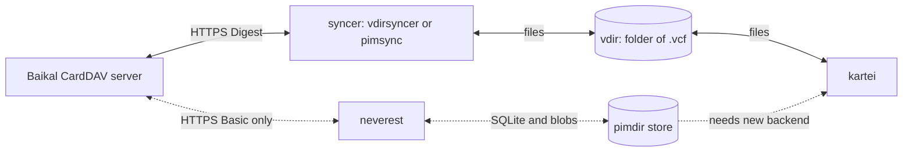

# Sync layers: Baïkal, vdirsyncer/pimsync, neverest, pimdir

2026-09-28. Follow-up to [contacts-tui.md](./contacts-tui.md) (syncer and client choice) and [contacts-tui-build.md](./contacts-tui-build.md) (why kartei exists). This note explains how the four names fit together and which syncer kartei should sit behind. Sources were cloned into the session scratchpad: `pimalaya/neverest` at `1d7db33`, `pimalaya/pimdir` at tag `draft-01`, `pimalaya/io-pimdir` at `v0.5.0`, `~whynothugo/pimsync` at `601c67c`, `pimutils/vdirsyncer` `docs/vdir.rst` at `605f878`.

## TL;DR

- **Four layers, one job each.** Baïkal is the server. vdirsyncer, pimsync and neverest are sync engines. vdir and pimdir are local store formats. kartei is a client.
- **vdir and pimdir are not compatible.** A vdir is a folder of `.vcf` files. A pimdir is a SQLite database plus a folder of hash-named blobs. pimdir is not a superset of vdir.
- **kartei cannot read a neverest store unchanged.** It would need a second storage backend: SQLite reads, blob writes and an action queue for edits. That is a new module, not a filter tweak.
- **neverest cannot log in to this Baïkal today.** Its CardDAV auth is Basic or Bearer only. Its HTTP crate has no Digest code.
- **Use vdirsyncer 0.21.0 now.** It is installed, speaks Digest, and kartei already works with it.
- **Move to pimsync later**, once Arch ships ≥0.6.0 or Baïkal switches to Basic. kartei needs no change for either vdirsyncer or pimsync.
- **Watch neverest, don't adopt it.** It is v0.2.0, one author, not packaged on Arch or AUR, and its store format is `draft-01`.

## 1. Who does what

| Layer       | Job                                         | Contacts, this setup                            | Email equivalent      |
| ----------- | ------------------------------------------- | ----------------------------------------------- | --------------------- |
| Server      | Holds the master copy, speaks a protocol    | Baïkal 0.12.1 (CardDAV)                         | IMAP server (Dovecot) |
| Sync engine | Copies changes both ways, detects conflicts | vdirsyncer, pimsync, or neverest                | mbsync, offlineimap   |
| Local store | The on-disk copy apps read                  | vdir (vdirsyncer, pimsync) or pimdir (neverest) | Maildir               |
| Client      | Shows and edits the local copy, no network  | kartei (also khard)                             | aerc, neomutt         |

- The sync engine is the only piece that talks to Baïkal.
- kartei only reads and writes files. It never opens a socket.
- The store format is the contract between syncer and client. Swap syncers inside one format and the client does not notice. Swap formats and the client must change.

Solid lines work today. Dotted lines are the neverest path, which needs Baïkal on Basic and a pimdir backend in kartei.

## 2. vdir vs pimdir

| Aspect          | vdir ([vdir.rst](https://github.com/pimutils/vdirsyncer/blob/main/docs/vdir.rst))               | pimdir draft-01 ([STORAGE.md](https://github.com/pimalaya/pimdir/blob/draft-01/STORAGE.md))                                                                                                    |
| --------------- | ----------------------------------------------------------------------------------------------- | ---------------------------------------------------------------------------------------------------------------------------------------------------------------------------------------------- |
| What it is      | A root folder, one subfolder per collection, one file per item                                  | One folder with `pimdir.db` (SQLite) and `objects/` (bodies), §3                                                                                                                               |
| Item file       | `<anything>.vcf` for vCard, `.ics` for iCalendar. Exactly one contact per file                  | `objects/<h[0:2]>/<h[2:4]>/<hash>`, no extension. Name is BLAKE3 (or truncated SHA-256) in lowercase base32, §5                                                                                |
| File name       | Opaque. Should resemble the UID. An edit must keep the original name                            | The content hash. An edit writes a new blob and repoints the row: "A blob is immutable"                                                                                                        |
| Metadata        | Optional extension-less files in the collection: `color`, `displayname`, `description`, `order` | Columns in `collections` (`name`, `color`, `description`, `sort_order`, `kind`, `account`), §4.3                                                                                               |
| Per-domain dirs | No. A collection is a calendar or an address book by its file extensions                        | No. One store holds mail, contacts and calendars. `collections.kind` is the media type (`text/vcard`)                                                                                          |
| Sync state      | Kept by the syncer outside the vdir (vdirsyncer/pimsync `status_path`)                          | Inside the store: `bindings`, `sources`, checkpoints, conflicts, retention, §4.3, §10                                                                                                          |
| Writes          | Atomic via a `.tmp` file in the collection, then rename                                         | Only one owner process mutates. Others enqueue actions in the `queue` table, §8, §15                                                                                                           |
| Deletes         | Unlink the file                                                                                 | Soft delete. A dropped item is retained until an explicit purge, §11                                                                                                                           |
| Readers must    | Ignore `*.tmp` and extension-less files                                                         | Ignore files they don't own, open read-only, take no lock, hide tombstones, §3, §8, §14.1                                                                                                      |
| Status          | Stable, unchanged in substance for years                                                        | `draft-01`, tagged 2026-09-06. Schema v1 is edited in place, and old stores are "recreated rather than migrated" ([README](https://github.com/pimalaya/pimdir/blob/draft-01/README.md#status)) |

- pimdir is a different design, not an extension. Its goals list "none of the pitfalls of file-per-item layouts" (STORAGE.md §1).
- pimdir's own history: 45 commits, all by Clément DOUIN, repo created 2026-07-31, 4 stars (`gh api repos/pimalaya/pimdir`, git log).
- neverest does not write a vdir at all. MIGRATION.md: "Local file backends are no longer sync sources: the local pimdir store is the local replica."

### What kartei does today

- `vdir::load` lists one directory, non-recursive, and keeps only paths whose extension is `vcf` (`src/vdir.rs`, `is_vcf`). `watch.rs` watches that one directory, non-recursive, with the same filter.
- So vdir metadata files (`color`, `displayname`) and `*.vcf.tmp` files are already ignored. kartei's own `save` writes `<name>.vcf.tmp` then renames, which matches the vdir write rule.
- `KARTEI_DIR` must point at the collection, not the root: `~/.local/share/contacts/default/`, not `~/.local/share/contacts/`. That matches the khard config in [contacts-tui.md](./contacts-tui.md#config-sketch-placeholders-no-secrets).

### Could kartei read a neverest store?

Not unchanged. Pointed at `~/.local/state/neverest/<account>/`, `load` finds no `.vcf` file: bodies have no extension and sit two shard levels deep.

What a pimdir backend in kartei would take, from STORAGE.md:

| Need                   | pimdir rule                                                                                                                                                                                                               |
| ---------------------- | ------------------------------------------------------------------------------------------------------------------------------------------------------------------------------------------------------------------------- |
| List contacts          | Open `pimdir.db` read-only (SQLite ≥3.37). Use `list_contacts_page_asc` / `get_contact`, keyed by `(collection, seq)`, §14.1                                                                                              |
| Read a card            | Look up `object_hash`, read `objects/<h[0:2]>/<h[2:4]>/<hash>`. A missing body means "not hydrated", not an error                                                                                                         |
| Detect changes         | `PRAGMA data_version` or the change feed (`list_items_changed_since`), not inotify on `.vcf` files, §4.5                                                                                                                  |
| Save an edit           | Act as a **producer**: take `objects.lock` shared, write the new blob atomically (period-prefixed temp in the shard dir, fsync, rename, fsync dir), then enqueue `update` `{v:1, seq, object}` with `pin_object`, §5, §15 |
| Create / delete        | Enqueue `add` or `remove`. The row stays until the next `neverest sync` drains the queue                                                                                                                                  |
| Conflict check on save | Compare the item's current `object_hash` with the one loaded, instead of today's byte compare in `vdir::conflict`                                                                                                         |

- Lossless editing still works: the blob is the raw bytes, and kartei would keep splicing lines.
- Edits become asynchronous. kartei would show "queued", and the change reaches Baïkal only on the next neverest run.
- Dependencies: `rusqlite` and `blake3` at least. Or `io-pimdir` 0.5.0 with its `client` feature, which ships reader and producer types (`client::{reader, producer, blobs}`, [io-pimdir CHANGELOG](https://github.com/pimalaya/io-pimdir/blob/master/CHANGELOG.md)).
- pimalaya's own client already does this: `cardamum` 0.2.0 has an optional `pimdir` feature on `io-pimdir 0.5` (`Cargo.toml`).

## 3. neverest

| Question           | Finding                                                                                                                                                                                                                                                                                                                               |
| ------------------ | ------------------------------------------------------------------------------------------------------------------------------------------------------------------------------------------------------------------------------------------------------------------------------------------------------------------------------------- |
| What it is         | "CLI to synchronize PIM collections: mail, contact, calendar". IMAP, CardDAV, CalDAV into one pimdir store per account ([README](https://github.com/pimalaya/neverest/blob/master/README.md))                                                                                                                                         |
| Release            | v0.2.0, CHANGELOG dated 2026-09-07, tag commit 2026-09-08 (+02:00). "a full rewrite on top of the I/O-free io-* ecosystem". Nothing from v0.1.0 is read ([CHANGELOG.md](https://github.com/pimalaya/neverest/blob/master/CHANGELOG.md))                                                                                               |
| CardDAV            | Added in 0.2.0 via `io-webdav`, behind the default `dav` feature. Uses RFC 6578 `sync-collection`, falls back to `PROPFIND`. Writes are `PUT`/`DELETE` with `If-Match` on the last ETag                                                                                                                                               |
| Auth               | **Basic or Bearer only.** `DavAuthConfig { Basic, Bearer }` (`src/config.rs` L1239-L1251). `io-http` 0.5.0 implements `rfc7617` (Basic) and `rfc6750` (Bearer), no RFC 7616 Digest module (`gh api repos/pimalaya/io-http/git/trees/master`). `grep -ri digest` in neverest finds only body digests                                   |
| Two-way            | Yes. One source, no targets = offline replica, synced both ways. `one-way = true` makes the source win                                                                                                                                                                                                                                |
| Conflicts          | Built-in three-way merge per field (vcard-rs `VcardMerge`). Different fields merge silently. Same field changed on both sides parks the item, the run exits 2, and `neverest conflict list/show/resolve` decides. `conflict.merger` hands the three bodies to an external tool                                                        |
| Deletes, retention | Soft delete. A card the server drops is kept in the store, hidden, until `store.purge-after` (unset = never purge). The sample config shows `carddav.item.delete = false` as an option to stop pushing local deletes ([config.sample.toml](https://github.com/pimalaya/neverest/blob/master/config.sample.toml) L236-L258, L325-L353) |
| Daemon / watch     | **None.** Commands are `init`, `sync`, `check`, `configure`, `conflict` (`src/cli/`). `src/account.rs` calls itself "exact for a one-shot run; a daemon would resolve a new account". Run it from a timer                                                                                                                             |
| Bytes              | Kept. Blobs are the raw server bytes, hashed whole. A merged body keeps the local side's bytes and adds the other side's hunks: "the store's own bytes survive byte for byte" (`src/kind/merge.rs` L15)                                                                                                                               |
| Maturity           | 116 commits, 52 in the last 12 months. Clément DOUIN 115, one other contributor 1. 316 stars, 1 open issue. Tags: v0.1.0 (2024-04-10), v1.0.0-beta (2024-04-15), v0.2.0. crates.io: 1,762 downloads. README: "v0.x: expect breaking changes between releases"                                                                         |
| Engine             | `io-pimdir` 0.5.0: 48 commits, one author, first published 2026-08-06, 2,067 downloads (crates.io)                                                                                                                                                                                                                                    |
| Arch               | Not in `extra` (`pacman -Si neverest`: not found). No AUR package for `neverest` (AUR RPC search, 0 results). Install via `cargo install --git`, Nix, or CI artifacts. README: the installer "has nothing to fetch" until v1                                                                                                          |

Net: good design for data safety (retention, per-field merge, byte preservation), but it cannot authenticate to Digest Baïkal, has no watch mode, and needs a new kartei backend.

## 4. pimsync and vdirsyncer: updates only

Facts from [contacts-tui.md](./contacts-tui.md#sync-layer) re-checked on 2026-09-28:

| Fact                 | 2026-09-25 note                       | Now                                                                                                                                                                                          |
| -------------------- | ------------------------------------- | -------------------------------------------------------------------------------------------------------------------------------------------------------------------------------------------- |
| pimsync latest tag   | v0.6.0, 2026-09-05                    | Unchanged. `CHANGELOG.rst` has an unreleased v0.6.1 entry: fixes a `sync` deadlock with automated conflict resolution when a collection must be created                                      |
| pimsync last commit  | 2026-09-21                            | Unchanged (`601c67c`, "Bump vstorage"). 5 commits since v0.6.0                                                                                                                               |
| pimsync activity     | 200 commits / 12 months               | 198 in the 12 months to 2026-09-28. 12 authors ever                                                                                                                                          |
| pimsync open tickets | unverified (502)                      | 107 on the todo.sr.ht default view. Relevant: #259 "digest_auth fork", #55 "Update baikal test server", #160 "vdir collection deletion fails if it has any properties"                       |
| Arch `extra` pimsync | 0.5.7, flagged out of date 2026-05-09 | Still 0.5.7-1, built 2026-03-11, still flagged ([archlinux.org JSON](https://archlinux.org/packages/search/json/?name=pimsync)). Predates Digest (0.5.10). No AUR `pimsync` or `pimsync-git` |
| vdirsyncer           | 0.21.0, installed                     | Unchanged. Arch `extra` 0.21.0-1, rebuilt 2026-09-06                                                                                                                                         |

## 5. Baïkal: what matters here

- `dav_auth_type: Digest` in `ansible/roles/baikal/templates/baikal.yaml.j2` (auberge repo).
- Baïkal 0.12.1 wires exactly one backend: `Basic` gives `PDOBasicAuth`, `Apache` defers to the web server, anything else gives Digest `Sabre\DAV\Auth\Backend\PDO` ([Server.php](https://github.com/sabre-io/Baikal/blob/0.12.1/Core/Frameworks/Baikal/Core/Server.php#L133-L141)). No "both" mode.
- Switching to Basic needs no password reset: `PDOBasicAuth` checks `md5(user:realm:pass)` against the stored `digesta1` ([PDOBasicAuth.php](https://github.com/sabre-io/Baikal/blob/0.12.1/Core/Frameworks/Baikal/Core/PDOBasicAuth.php#L66-L78)).
- Cost of the switch: every client must send Basic. A vdirsyncer storage with `auth = "digest"` or pimsync with `auth_method digest` must change to `basic` the same day.
- Basic sends the password on every request, base64-encoded. It is safe only over TLS, which Caddy already terminates.
- Gain: unblocks Arch pimsync 0.5.7, neverest, cardamum and aerc `carddav-query`.

## 6. Recommendation

| When                  | Syncer                                      | Store  | kartei change                                                                                     | Trigger to move on                                                                                      |
| --------------------- | ------------------------------------------- | ------ | ------------------------------------------------------------------------------------------------- | ------------------------------------------------------------------------------------------------------- |
| **Now**               | vdirsyncer 0.21.0, `auth = "digest"`, timer | vdir   | None. Point `KARTEI_DIR` at `.../contacts/default/`                                               | pimsync ≥0.6.0 lands in Arch `extra`, or Baïkal goes Basic                                              |
| **Next**              | `pimsync daemon`                            | vdir   | None. Same folder, new `status_path`. The daemon pushes kartei's saves within seconds via inotify | Only if pimsync stalls or loses data                                                                    |
| **Maybe, much later** | neverest                                    | pimdir | New storage backend (table in §2), queued edits, SQLite dependency                                | All of: neverest ≥1.0 and packaged, pimdir STORAGE frozen, Baïkal on Basic (or Digest added to io-http) |

- Stay on vdir. Both vdir syncers keep kartei working with zero code. That keeps kartei's scope promise: sync stays out of scope ([contacts-tui-build.md](./contacts-tui-build.md)).
- pimsync wins over vdirsyncer on two points: CRLF line endings and a daemon that reacts to kartei's saves. Both come without kartei changes.
- Do not add a pimdir backend to kartei yet. The format is a draft that rebuilds stores rather than migrating them. neverest has one author and no package. And a Digest server blocks it outright.
- Re-check neverest when either repo tags a release, or when pimdir tags `STORAGE` as frozen (its README says STORAGE freezes first).

## Open questions

- Switch Baïkal to Basic? It unblocks Arch pimsync and neverest. Every device's client must change the same day.
- Does any other device (phone, Thunderbird) still need Digest? If yes, stay on Digest and build pimsync 0.6.0 from source.
- pimsync ticket #259 "digest_auth fork": does it touch Digest correctness against sabre/dav? Read before moving.
